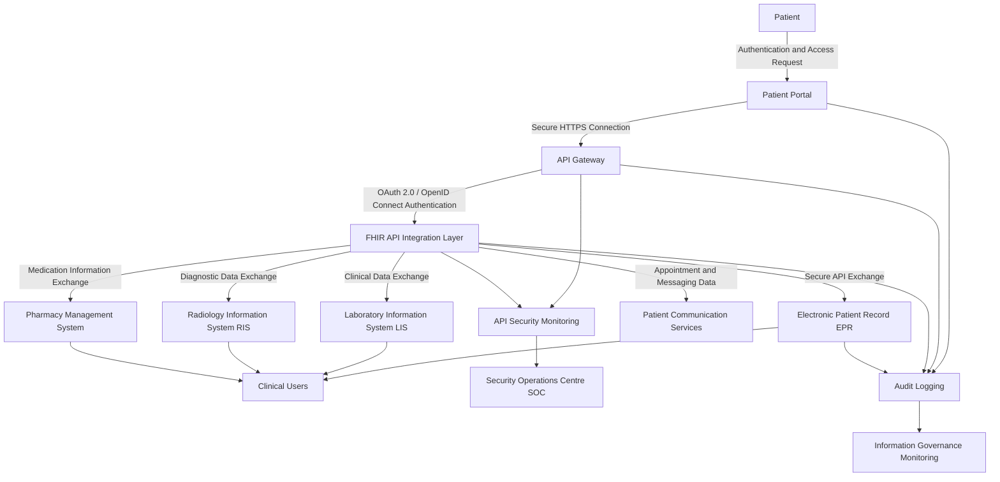
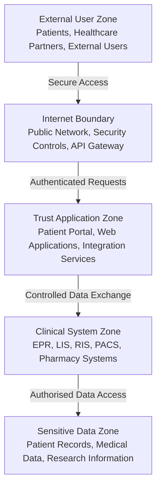

# Data Protection Impact Assessment (DPIA)
## Project SentinelCare – Cyber Security Governance, Risk and Compliance Improvement Programme

**Organisation:** Westbridge University Hospitals Foundation Trust (WUHNFT)  
**Assessment Subject:** Patient Portal and Healthcare Interoperability Platform (FHIR API)  
**Document Type:** Data Protection Impact Assessment  
**Owner:** Data Protection Officer (DPO)  
**Assessment Status:** Draft Assessment  
**Classification:** Portfolio Case Study – Fictional Organisation  
**Version:** 1.0  

---

# 1. Purpose of Assessment

This Data Protection Impact Assessment (DPIA) evaluates the privacy and security risks associated with the Trust's **Patient Portal and Healthcare Interoperability Platform**.

The assessment has been completed to ensure that:

- Patient information is processed lawfully and securely.
- Privacy risks are identified and mitigated.
- Security controls are appropriate for sensitive healthcare data.
- The Trust can demonstrate compliance with UK GDPR requirements.

---

# 2. Project Overview

## Solution Description

The Trust operates a digital patient platform that allows patients to:

- View appointments.
- Access selected medical information.
- Receive healthcare messages.
- Communicate with healthcare teams.
- Access digital healthcare services.

The platform integrates with internal Trust systems through healthcare interoperability services using APIs.

The platform exchanges information with:

- Electronic Patient Record (EPR).
- Laboratory Information System (LIS).
- Radiology Information System (RIS).
- Pharmacy systems.
- External healthcare providers.

---

# 3. DPIA Trigger

A DPIA is required because the solution involves:

- Processing of special category health data.
- Large-scale processing of patient information.
- Digital access to confidential medical records.
- Automated data exchange between multiple systems.
- External user access.
- Cloud-based processing.

---

# 4. Data Controller and Responsibilities

| Role | Responsibility |
|---|---|
| Data Controller | Westbridge University Hospitals Foundation Trust |
| Data Protection Officer | Provides privacy oversight |
| Clinical Information Asset Owner | Ensures appropriate clinical use |
| Cyber Security Team | Advises on security controls |
| Digital Services Team | Maintains platform security |
| System Supplier | Provides technical support and maintenance |

---

# 5. Information Processing Description

## Personal Data Processed

The platform processes:

| Data Category | Examples | Classification |
|---|---|---|
| Identity Information | Name, date of birth, NHS number | Restricted |
| Contact Information | Address, phone number, email | Restricted |
| Healthcare Information | Diagnoses, treatments, clinical notes | Restricted |
| Appointment Information | Clinic visits and schedules | Restricted |
| Laboratory Information | Test results | Restricted |
| Communication Records | Patient messages | Restricted |

---

# 6. Special Category Data

The solution processes special category data including:

- Medical history.
- Physical and mental health information.
- Medication information.
- Diagnostic results.
- Treatment information.

Under UK GDPR, health information requires enhanced protection due to the potential harm caused by unauthorised disclosure.

# 7. Purpose of Processing

The Trust processes patient information to:

- Provide healthcare services.
- Support clinical decision-making.
- Improve patient access to services.
- Enable digital communication.
- Improve healthcare coordination.
- Support patient safety.

# 8. Lawful Basis for Processing

| Processing Activity | Lawful Basis |
|---|---|
| Delivery of healthcare services | Public task |
| Management of patient records | Legal obligation / public task |
| Provision of digital patient services | Public task |
| Processing health information | Provision of healthcare and management of health systems |
| Service improvement activities | Public interest |

# 9. Data Flow Overview

The Patient Portal and Healthcare Interoperability Platform enables patients, clinicians, and authorised healthcare partners to securely exchange healthcare information.

The data flow represents how patient information moves between external users, digital services, clinical systems, and supporting security controls.

For a GRC/DPIA document, this is useful because it demonstrates:

| DPIA Requirement               | Mermaid Component                    |
| ------------------------------ | ------------------------------------ |
| Identify data sources          | Patient Portal                       |
| Identify processing systems    | FHIR API, EPR, LIS, RIS              |
| Identify recipients            | Clinical Users                       |
| Identify security controls     | API Gateway, Authentication, Logging |
| Identify monitoring capability | SOC and IG Monitoring                |

---
This represents a simplified security trust boundary model for the DPIA.
- DPIA Assessment → understanding personal data flows.
- NCSC CAF A2 / A3 → protecting systems and data.
- ISO 27001 → security architecture and access control.
- STRIDE Threat Modelling → identifying threats at each boundary.

## Privacy Risks Assessment

| Risk ID  | Privacy Risk                                        | Likelihood | Impact | Risk Level |
| -------- | --------------------------------------------------- | ---------- | ------ | ---------- |
| DPIA-001 | Unauthorised access to patient records              | Medium     | High   | High       |
| DPIA-002 | Patient data exposed through API vulnerability      | Medium     | High   | High       |
| DPIA-003 | Incorrect patient identity matching                 | Medium     | High   | High       |
| DPIA-004 | Excessive staff access permissions                  | High       | High   | Critical   |
| DPIA-005 | Patient information stored outside approved systems | Medium     | High   | High       |
| DPIA-006 | Supplier access to patient information              | Medium     | High   | High       |
| DPIA-007 | Insufficient audit logging                          | Medium     | Medium | Medium     |

## 11. Security and Privacy Controls
### Identity and Access Management

Controls:

- Multi-factor authentication for patient accounts.
- Role-based access control.
- Privileged access management.
- Regular access reviews.
- Least privilege enforcement.

### Data Protection Controls

Controls:

- Encryption at rest.
- Encryption in transit.
- Secure API communication.
- Data minimisation.
- Retention controls.
- Secure deletion.

### API Security Controls

Controls:

- OAuth 2.0 / OpenID Connect authentication.
- API gateway controls.
- Rate limiting.
- Input validation.
- API monitoring.
- Security testing.

### Monitoring and Audit Controls

Controls:

- Patient access logging.
- Administrative activity monitoring.
- Security event monitoring.
- Alerting for suspicious behaviour.
- Regular log reviews.