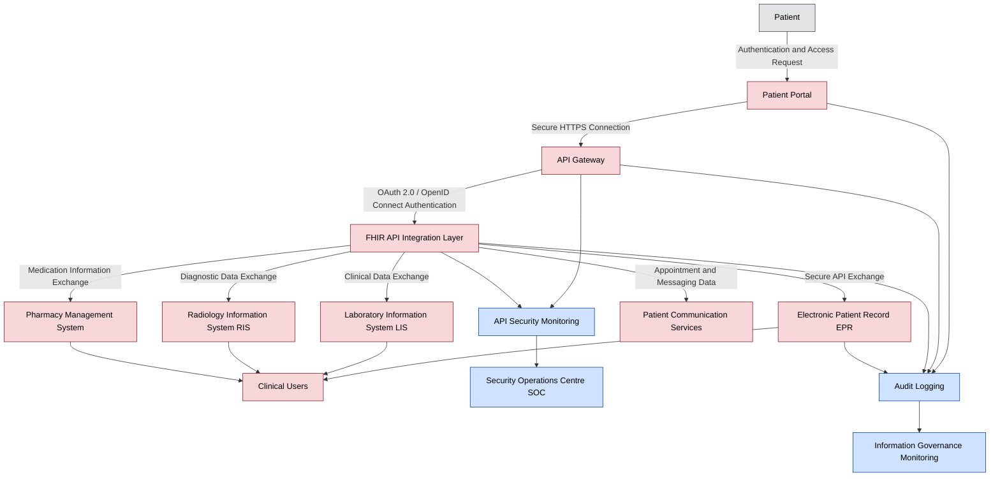

# Data Flow Diagram — Patient Portal and Healthcare Interoperability Platform

**Organisation:** Westbridge Hospitals Trust (WHT)  
**Document Type:** Data Flow Diagram  
**Owner:** Data Protection Officer (DPO) / Information Governance Team  
**Classification:** Portfolio Case Study – Fictional Organisation  
**Version:** 1.0  

## Purpose

This diagram shows how patient information moves between external users, digital services, clinical systems, and supporting security controls for the Patient Portal and Healthcare Interoperability Platform. It is referenced by [062-data_protection_impact_assessment](../062-data_protection_impact_assessment.md) §9 and [063-data_lineage_assessment](../063-data_lineage_assessment.md) §5.

## Colour Convention

Nodes are coloured by the classification of the data they process, per [061-data_classification](../061-data_classification.md) §4. The full legend is explained once in [063-data_lineage_assessment](../063-data_lineage_assessment.md) §5:

- 🔴 Restricted — patient/clinical data
- 🔵 Internal — security, monitoring, and audit data
- ⚪ External Actor — outside the Trust's classification scheme

## Diagram

## GRC Relevance

| DPIA Requirement | Mermaid Component |
|---|---|
| Identify data sources | Patient Portal |
| Identify processing systems | FHIR API, EPR, LIS, RIS |
| Identify recipients | Clinical Users |
| Identify security controls | API Gateway, Authentication, Logging |
| Identify monitoring capability | SOC and IG Monitoring |
