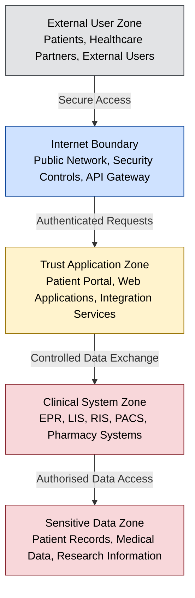

# Trust Boundary Diagram — Patient Portal and Healthcare Interoperability Platform

**Organisation:** Westbridge Hospitals Trust (WHT)  
**Document Type:** Data Flow Diagram (Trust Boundary Model)  
**Owner:** Data Protection Officer (DPO) / Information Governance Team  
**Classification:** Portfolio Case Study – Fictional Organisation  
**Version:** 1.0  

## Purpose

This diagram represents a simplified security trust boundary model for the Patient Portal, showing how data sensitivity increases moving from the external user zone toward the sensitive data zone. It is referenced by [062-data_protection_impact_assessment](../062-data_protection_impact_assessment.md) §9 and [063-data_lineage_assessment](../063-data_lineage_assessment.md) §5.

This model is useful for:

- DPIA Assessment → understanding personal data flows.
- NCSC CAF A2 / A3 → protecting systems and data.
- ISO 27001 → security architecture and access control.
- STRIDE Threat Modelling → identifying threats at each boundary.

## Colour Convention

Zones are coloured on a gradient by data sensitivity, per [061-data_classification](../061-data_classification.md) §4 — the full legend is explained once in [063-data_lineage_assessment](../063-data_lineage_assessment.md) §5.

## Diagram

