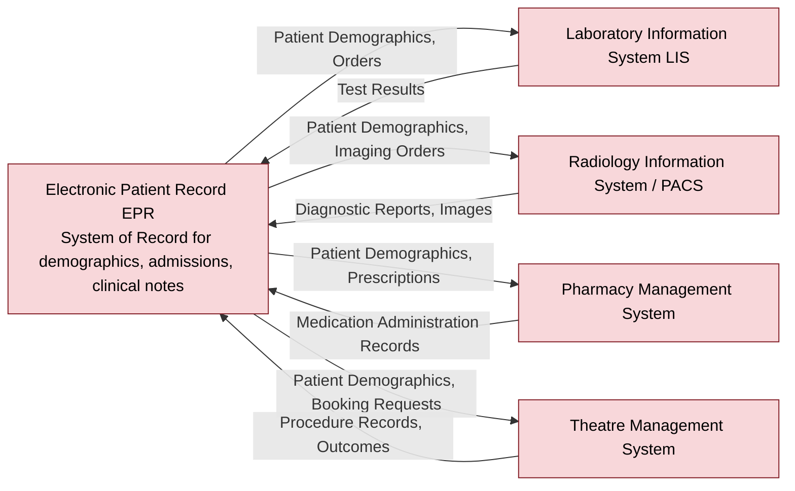

# Data Flow Diagram — Core Clinical Systems

**Organisation:** Westbridge Hospitals Trust (WHT)  
**Document Type:** Data Flow Diagram  
**Owner:** Data Protection Officer (DPO) / Information Governance Team  
**Classification:** Portfolio Case Study – Fictional Organisation  
**Version:** 1.0  

## Purpose

This diagram shows data exchange between the Trust's core clinical systems — the Electronic Patient Record (EPR), Laboratory Information System (LIS), Radiology Information System / PACS (RIS/PACS), Pharmacy Management System, and Theatre Management System — which is not visualised elsewhere in the programme. It is referenced by [063-data_lineage_assessment](../063-data_lineage_assessment.md) §5.

## Colour Convention

All nodes in this diagram process Restricted patient data, per [061-data_classification](../061-data_classification.md) §4 — the full legend is explained once in [063-data_lineage_assessment](../063-data_lineage_assessment.md) §5.

## Diagram

## Notes

The EPR is the designated system of record for patient demographics — all other clinical systems receive demographic data from the EPR and return domain-specific results back to it, consistent with the system-of-record register in [063-data_lineage_assessment](../063-data_lineage_assessment.md) §4. This bidirectional dependency is why EPR availability (CR-001, ransomware) has a compounding impact across every other clinical system.
