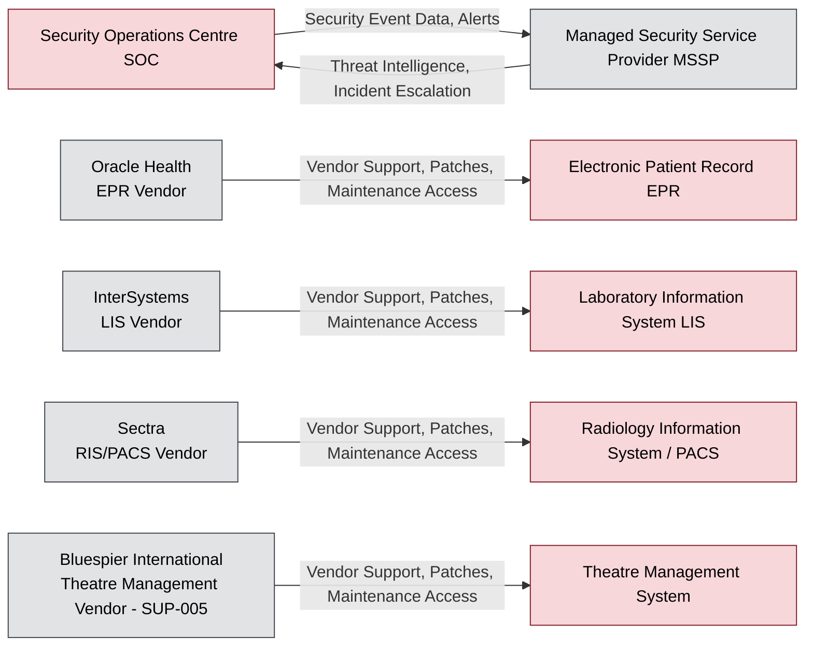

# Data Flow Diagram — Third-Party Data Exchange

**Organisation:** Westbridge Hospitals Trust (WHT)  
**Document Type:** Data Flow Diagram  
**Owner:** Procurement Director / Data Protection Officer (DPO)  
**Classification:** Portfolio Case Study – Fictional Organisation  
**Version:** 1.0  

## Purpose

This diagram shows data flows between the Trust's core clinical systems and the external vendors that support them, plus the Trust's managed security service provider. It is referenced by [063-data_lineage_assessment](../063-data_lineage_assessment.md) §6, and reflects the vendor dependencies identified in [../../04-Risk-Management/043-third_party_risks](../../04-Risk-Management/043-third_party_risks.md).

## Colour Convention

Trust-owned systems are coloured Restricted (red); external supplier organisations are coloured as external actors (grey), per [061-data_classification](../061-data_classification.md) §4 — the full legend is explained once in [063-data_lineage_assessment](../063-data_lineage_assessment.md) §5.

## Diagram

## Notes

Bluespier International (SUP-005) is flagged "Approaching Renewal" while the Theatre Management System it supports is on legacy vendor-extended support — the compounded position tracked as [043-third_party_risks](../../04-Risk-Management/043-third_party_risks.md) TPR-001 and REC-002. This diagram makes that single-vendor dependency visible: loss of Bluespier support directly affects Theatre Management data exchange with no documented fallback vendor.
