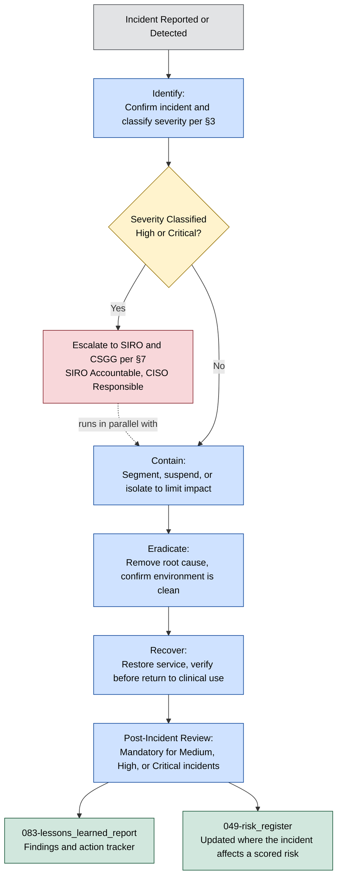
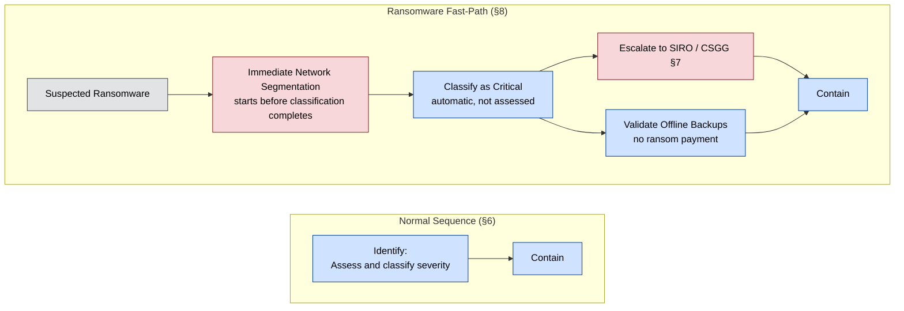

# Incident Response Plan

**Organisation:** Westbridge Hospitals Trust (WHT)  
**Document Type:** Incident Response Plan  
**Owner:** Chief Information Security Officer (CISO)  
**Classification:** Portfolio Case Study – Fictional Organisation  
**Version:** 1.0  

# 1. Purpose

This plan sets out how WHT identifies, contains, eradicates, and recovers from cyber security incidents, and how it communicates about them internally and to regulators. It is the document already cited as existing evidence in [../03-Current-State-Assessment/022-caf_assessment](../03-Current-State-Assessment/022-caf_assessment.md) §4.4 (CAF D1) and [../03-Current-State-Assessment/024-dsp_toolkit_review](../03-Current-State-Assessment/024-dsp_toolkit_review.md) §4.5 (DSPT Standard 6), and closes the gap previously tracked in `NAVIGATION.md`'s Known Cross-Reference Gap note.

# 2. Scope

This plan applies to all cyber security incidents affecting WHT information, systems, or services — clinical, corporate, and third-party-hosted where the Trust retains security responsibility, per [../01-Discovery/005-project_scope](../01-Discovery/005-project_scope.md). It does not cover general clinical safety incidents unrelated to cyber activity, which follow the Trust's separate clinical governance process, or business continuity invocation itself, which is addressed in [../10-Business-Continuity/](../10-Business-Continuity/).

# 3. Incident Classification

Incidents are classified using the same four-point scale already used for risk rating across the programme ([../04-Risk-Management/047-risk_methodology](../04-Risk-Management/047-risk_methodology.md) §2.2), so that incident severity and risk scoring speak a common language:

| Severity | Description | Example |
|---|---|---|
| Critical | Patient safety or major organisational impact; Critical-rated risk materialising | Ransomware affecting clinical systems (CR-001) |
| High | Significant operational or regulatory impact | Confirmed unauthorised access to Restricted data |
| Medium | Service impact requiring management attention | Isolated malware detection, contained quickly |
| Low | Minimal operational impact | Failed phishing attempt, no compromise |

Critical and High severity incidents trigger the escalation path in §7.

# 4. Roles & Responsibilities

Incident response roles follow the RACI already defined in [../05-Governance/052-roles_and_responsibilities](../05-Governance/052-roles_and_responsibilities.md) §4: the CISO is Responsible for incident response, the SIRO is Accountable, the DPO is Consulted on any incident involving personal data, and the Cyber Security Governance Group (CSGG) is kept Informed and reviews incident response governance as a standing function ([051-security_strategy](../05-Governance/051-security_strategy.md) §6). This plan does not redefine those roles — it operationalises them.

| Role | Incident Response Function |
|---|---|
| CISO | Incident Commander; leads response, coordinates Cyber Security Team, approves containment actions |
| SIRO | Accountable for the incident response decision; approves regulatory notification for High/Critical incidents |
| Cyber Security Team | Executes detection, containment, eradication, and recovery actions |
| DPO | Assesses personal data breach notification obligations; leads ICO liaison |
| CDIO | Coordinates clinical/operational system impact and recovery priorities |
| Clinical Safety Officer | Assesses and manages patient safety implications of any incident affecting clinical systems |
| Cyber Security Governance Group (CSGG) | Informed of all High/Critical incidents; reviews incident response effectiveness as a standing agenda item |

# 5. Detection & Reporting

Detection currently relies on the Security Monitoring Platform (AST-019) and the Managed Security Service Provider relationship (AST-035). Consistent with the current CAF position — C1 Security Monitoring and C2 Proactive Security Event Discovery are both rated **Not Achieved** ([../03-Current-State-Assessment/022-caf_assessment](../03-Current-State-Assessment/022-caf_assessment.md) §3) — this plan does not assume continuous, correlated detection capability. Until that gap closes (CAF REC-005), detection also depends on manual reporting: any member of staff who suspects a security incident must report it immediately to the Cyber Security Team via the Service Desk, per [../05-Governance/053-information_security_policy](../05-Governance/053-information_security_policy.md) §3.

All reported and detected incidents are logged, given a severity classification (§3), and assigned an Incident Commander from the Cyber Security Team.

# 6. Response Phases

This plan follows a standard five-phase incident lifecycle. The diagram below shows the sequence and the one key branch point — high-severity incidents trigger internal escalation (§7) in parallel with containment, not after it:

## Identify
Confirm whether a reported or detected event is a genuine security incident, classify its severity (§3), and assign an Incident Commander.

## Contain
Take immediate action to limit the spread or impact of the incident — network segmentation, account suspension, system isolation — balancing containment speed against preserving evidence and maintaining critical clinical services.

## Eradicate
Remove the root cause of the incident (malware, unauthorised access, misconfiguration) and confirm the environment is clean before recovery begins.

## Recover
Restore affected systems and services to normal operation, prioritising Critical-rated assets per [../02-Asset-Management/022-master_assets_register.xlsx](../02-Asset-Management/022-master_assets_register.xlsx), with verification before systems are returned to clinical use.

## Post-Incident Review
Every Medium, High, or Critical incident undergoes a post-incident review, feeding findings into [083-lessons_learned_report](083-lessons_learned_report.md) and, where relevant, into the risk register ([../04-Risk-Management/049-risk_register](../04-Risk-Management/049-risk_register.md)).

# 7. Communication & Notification

## Internal Escalation

High and Critical severity incidents are escalated immediately to the SIRO (Accountable) and reported to the CSGG at its next meeting, or convened out-of-cycle for Critical incidents, following the same escalation path CSGG uses for matters outside its mandate ([../05-Governance/052-roles_and_responsibilities](../05-Governance/052-roles_and_responsibilities.md) §3): SIRO → Audit and Risk Committee → Trust Board.

## Regulatory Notification

| Trigger | Notify | Timeframe | Owner |
|---|---|---|---|
| Personal data breach with risk to individuals | Information Commissioner's Office (ICO) | Within 72 hours of becoming aware | DPO |
| Incident affecting NHS systems or shared care records | NHS England / Integrated Care Board (ICB) | As soon as practicable | CISO |
| Significant cyber incident (NIS Regulations scope) | National Cyber Security Centre (NCSC) | As soon as practicable | CISO |
| Incident with clinical safety impact | Care Quality Commission (CQC), via existing clinical governance process | Per clinical governance timelines | Clinical Safety Officer |

# 8. Ransomware-Specific Procedures

Ransomware is the Trust's highest-scored risk (CR-001, Likelihood 5 × Impact 5 = 25, Critical; Risk Owner CDIO, Treatment Owner CISO; treatment status **In Progress** — [../04-Risk-Management/049-risk_register](../04-Risk-Management/049-risk_register.md) §5). In addition to the standard response phases (§6), a suspected or confirmed ransomware incident triggers:

- Immediate network segmentation to prevent lateral spread, ahead of full containment assessment.
- Activation of offline backup validation and restoration procedures, without paying any ransom demand.
- Automatic classification as Critical severity and immediate SIRO/CSGG escalation (§7), regardless of initially observed scope.
- Coordination with [../10-Business-Continuity/](../10-Business-Continuity/) for clinical service continuity if EPR or other Critical-rated systems are affected.

The diagram below shows how this overrides the normal §6 sequence — segmentation and classification happen immediately and automatically rather than in the assessed order §6 otherwise implies:

Consistent with [../04-Risk-Management/046-risk_treatment_plans](../04-Risk-Management/046-risk_treatment_plans.md) §4.2, this plan does not assume ransomware risk can be fully eliminated: even with these procedures embedded, CR-001's expected residual rating remains **High**, not Low or Medium.

# 9. Testing & Exercise Cadence

This plan is exercised at least annually, closing [022-caf_assessment](../03-Current-State-Assessment/022-caf_assessment.md) REC-006 ("formalise a testing and lessons-learned cadence for the Incident Response and Business Continuity Plans"). The first exercise under this plan is recorded in [082-ransomware_tabletop_exercise](082-ransomware_tabletop_exercise.md); findings and actions are tracked in [083-lessons_learned_report](083-lessons_learned_report.md). Ad hoc exercises are also triggered following any material change to the Trust's threat landscape ([../04-Risk-Management/044-threat_assessment](../04-Risk-Management/044-threat_assessment.md)) or digital estate.

# 10. Review and Maintenance

This plan is reviewed annually by the CISO and ratified by the CSGG, or sooner following a Critical-severity incident, a material change to the Trust's digital estate, or findings from an exercise or real incident that indicate the plan itself needs revision.
