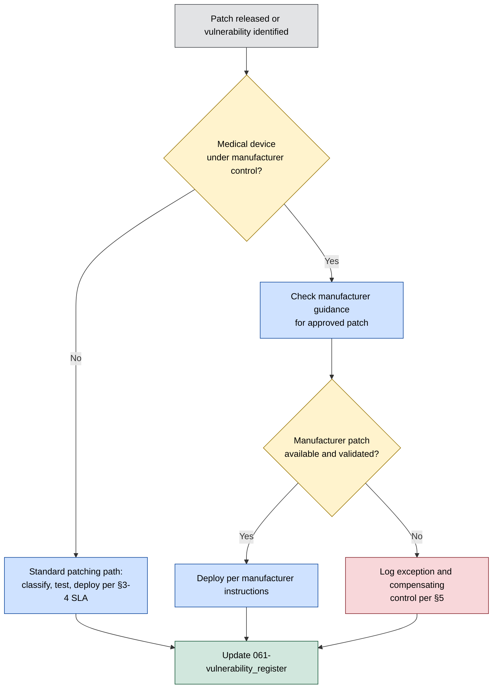

# Patch Management Policy

**Organisation:** Westbridge Hospitals Trust (WHT)
**Document Type:** Patch Management Policy and Process
**Owner:** Infrastructure Manager
**Classification:** Portfolio Case Study – Fictional Organisation
**Version:** 1.0

# 1. Purpose

This policy defines how WHT applies security patches across its digital estate to reduce the window of exposure to known vulnerabilities recorded in the [vulnerability register](061-vulnerability_register.md), and supports the CAF B4 System Security principle, currently rated **Partially Achieved** ([../03-Current-State-Assessment/022-caf_assessment](../03-Current-State-Assessment/022-caf_assessment.md) §3).

# 2. Scope

This policy applies to all assets in the [master assets register](../02-Asset-Management/022-master_assets_register.xlsx): servers, endpoints, network infrastructure, cloud services, and connected medical devices. It does not override manufacturer instructions for use on regulated medical devices, which take precedence where they conflict with standard IT patching practice (§6).

# 3. Patch Classification

| Classification | Description |
|---|---|
| Critical/Security | Addresses a Critical or High severity vulnerability per [061-vulnerability_register](061-vulnerability_register.md) §4, or is vendor-flagged as actively exploited |
| Routine | Addresses a Medium or Low severity vulnerability, or is a non-security update |
| Feature/Optional | Functional updates with no direct security relevance |

# 4. Patching Cadence and SLAs

Patching cadence is driven by asset criticality tier, as recorded in the [critical assets register](../02-Asset-Management/026-critical_assets_register.xlsx), and aligned to the vulnerability remediation SLAs in [061-vulnerability_register](061-vulnerability_register.md) §6:

| Patch Classification | Standard Assets | Critical-Rated Assets |
|---|---|---|
| Critical/Security | 30 days | 14 days |
| Routine | Next scheduled maintenance window | 90 days |
| Feature/Optional | At Infrastructure Manager discretion | At Infrastructure Manager discretion |

All patches are deployed to a test environment or representative sample before production rollout, in line with existing change control practice.

# 5. Medical Devices — Constrained Patching

Risk CR-003 records that unsupported medical devices carry elevated risk because "vendor patching options are limited" ([risk register](../04-Risk-Management/049-risk_register.md) §5, CR-003). This policy does not assume medical devices can be patched to the same cadence as general IT assets. Where a manufacturer does not provide a patch, or where a patch requires re-validation the manufacturer has not completed, the device is not patched outside manufacturer guidance. Instead:

1. The device and its unpatched vulnerability are logged in the [vulnerability register](061-vulnerability_register.md) with status "Open — compensating controls applied."
2. The Clinical Engineering Manager (CR-003 risk owner) and Infrastructure Manager jointly document a compensating control (network segmentation, restricted connectivity, enhanced monitoring where feasible).
3. The exception is reviewed at the cadence in §7 and remains open until the manufacturer issues a patch or the device is decommissioned/replaced.

This is a documented exception process, not a resolution of CR-003 — the risk's residual rating remains elevated regardless of compensating controls applied, consistent with [046-risk_treatment_plans](../04-Risk-Management/046-risk_treatment_plans.md).

# 6. Patch Deployment Process

# 7. Roles and Responsibilities

Roles follow the RACI already defined in [../05-Governance/052-roles_and_responsibilities](../05-Governance/052-roles_and_responsibilities.md); this policy operationalises rather than redefines them.

| Role | Patch Management Function |
|---|---|
| Infrastructure Manager | Owns patch deployment for general IT estate; maintains patching cadence against SLA |
| Clinical Engineering Manager | Owns medical device patch/exception decisions jointly with Infrastructure Manager |
| CISO | Approves policy; escalation point where SLA cannot be met outside a documented exception |
| Cyber Security Governance Group (CSGG) | Reviews patching compliance and open exceptions per §8 |

# 8. Review and Reporting

Patch compliance and open exceptions (including all CR-003-linked medical device exceptions) are reported monthly to the CISO and reviewed quarterly by the CSGG, consistent with the governance cadence in [051-security_strategy](../05-Governance/051-security_strategy.md) §6.
