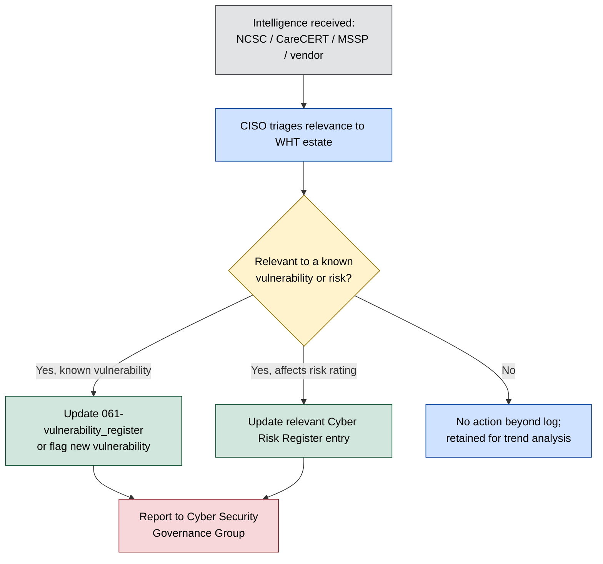

# Threat Intelligence Process

**Organisation:** Westbridge Hospitals Trust (WHT)
**Document Type:** Threat Intelligence Process
**Owner:** CISO
**Classification:** Portfolio Case Study – Fictional Organisation
**Version:** 1.0

# 1. Purpose

This document defines how WHT gathers, assesses, and disseminates cyber threat intelligence, and how that intelligence feeds into the Trust's risk, vulnerability, and incident management processes. It is cited as evidence in [../03-Current-State-Assessment/022-caf_assessment](../03-Current-State-Assessment/022-caf_assessment.md) §4.3 for CAF Objective C (Detecting Cyber Security Events), which is currently rated **Not Achieved** across both C1 Security Monitoring and C2 Proactive Security Event Discovery. This document should be read as a description of WHT's current process, not as evidence that the C1/C2 gap is closed.

# 2. Scope

This process covers external cyber threat intelligence relevant to UK healthcare and to WHT's specific digital estate, as already characterised in [../04-Risk-Management/044-threat_assessment](../04-Risk-Management/044-threat_assessment.md). It does not cover internal security event monitoring or log analysis, which depend on the Security Monitoring Platform capability (AST-019) that CAF C1 finds not yet sufficient.

# 3. Intelligence Sources

| Source | Description |
|---|---|
| NCSC alerts and advisories | National Cyber Security Centre threat and vulnerability advisories, including sector-specific healthcare guidance |
| NHS Digital / CareCERT | National NHS threat intelligence and incident alerting service |
| MSSP threat feed | Curated threat intelligence provided through the Managed Security Service Provider relationship (AST-035) |
| Vendor security advisories | Security bulletins from software and medical device manufacturers |

Intelligence intake from these sources is currently manual and periodic rather than continuously correlated against WHT's own telemetry — the same underlying capability gap recorded as CAF C1/C2 Not Achieved and tracked as REC-005 in [../03-Current-State-Assessment/022-caf_assessment](../03-Current-State-Assessment/022-caf_assessment.md) §8.

# 4. Relationship to the Threat Assessment

Intelligence gathered through this process is used to keep the threat actor ratings in [044-threat_assessment](../04-Risk-Management/044-threat_assessment.md) current, rather than duplicating that assessment. In particular:

- Ransomware and data-extortion intelligence (044 §4.1) is prioritised, consistent with CR-001 being the Trust's highest-scored risk.
- Cloud identity phishing/MFA-fatigue intelligence (044 §4.2) is routed to the IAM Manager given CAF B2 is rated Not Achieved.
- Supply chain compromise intelligence (044 §4.3) is routed to Procurement per the supplier assurance process ([../05-Governance/055-supplier_security_policy](../05-Governance/055-supplier_security_policy.md)).
- Advisories on unsupported/legacy system exploitation (044 §4.4) are routed directly to [061-vulnerability_register](061-vulnerability_register.md) and, where medical devices are affected, to the Clinical Engineering Manager as CR-003 risk owner.

# 5. Dissemination Process

Critical and High-relevance intelligence (e.g. an actively exploited vulnerability affecting a Critical-rated asset) is escalated to the CISO and reported to the Cyber Security Governance Group at its next meeting, or out-of-cycle if it indicates imminent risk, following the same escalation path used for incidents ([../08-Incident-Management/081-incident_response_plan](../08-Incident-Management/081-incident_response_plan.md) §7).

# 6. Roles and Responsibilities

| Role | Threat Intelligence Function |
|---|---|
| CISO | Owns the process; triages intelligence and reports to CSGG |
| Infrastructure Manager | Actions intelligence affecting the vulnerability register or patch management |
| Clinical Engineering Manager | Actions intelligence affecting medical devices, in line with CR-003 |
| Cyber Security Governance Group (CSGG) | Receives Critical/High intelligence reports; reviews trends as a standing agenda item |

# 7. Review and Maintenance

This process is reviewed annually by the CISO, or sooner if the Trust's monitoring capability materially changes (closing REC-005 would be expected to move this process from periodic, manual triage to continuous, correlated detection). Any such change should be reflected here and in an updated CAF C1/C2 rating in [022-caf_assessment](../03-Current-State-Assessment/022-caf_assessment.md).
