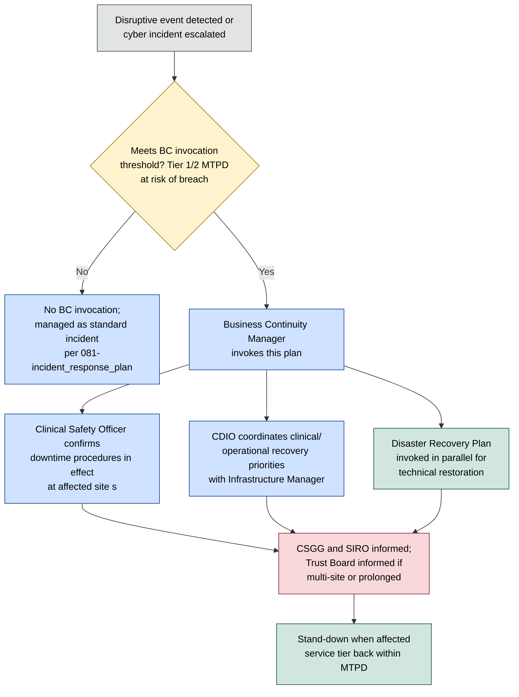

# Business Continuity Plan

**Organisation:** Westbridge Hospitals Trust (WHT)
**Document Type:** Business Continuity Plan
**Owner:** Business Continuity Manager
**Classification:** Portfolio Case Study – Fictional Organisation
**Version:** 1.0

# 1. Purpose

This plan sets out how WHT maintains and recovers delivery of its critical clinical and corporate services when a disruptive incident — cyber or otherwise — prevents normal operation. It is the document already cited as existing evidence in [../03-Current-State-Assessment/022-caf_assessment](../03-Current-State-Assessment/022-caf_assessment.md) §4.4 (CAF Objective D) and §9 (REC-006), and closes the gap previously tracked in `../NAVIGATION.md`'s Known Cross-Reference Gap note. This plan addresses **continuity of service** — keeping clinical and corporate functions running, including by manual or degraded means; technical restoration of IT systems and data is addressed in the companion [102-disaster_recovery_plan](102-disaster_recovery_plan.md).

# 2. Scope

This plan covers WHT's acute hospital sites and community healthcare centres described in [../01-Discovery/002-organisation_profile](../01-Discovery/002-organisation_profile.md) §2, and applies to disruption of any Critical or High-rated asset in the [master assets register](../02-Asset-Management/022-master_assets_register.xlsx). It covers cyber-originated disruption (ransomware, systems outage, data loss), and non-cyber disruption (power, facilities, third-party/utility failure) where the response depends on the same continuity structures. It does not cover the technical incident response process itself, which is addressed in [../08-Incident-Management/081-incident_response_plan](../08-Incident-Management/081-incident_response_plan.md), or technical system/data restoration, which is addressed in [102-disaster_recovery_plan](102-disaster_recovery_plan.md) — this plan governs the handoff between those two and the continuity of patient-facing and corporate services while they are underway.

# 3. Business Impact Analysis

Service tiers are derived from the Critical/High asset ratings in the [critical assets register](../02-Asset-Management/026-critical_assets_register.xlsx) and the asset groupings in [021-digital_asset_estate](../02-Asset-Management/021-digital_asset_estate.md). Maximum Tolerable Period of Disruption (MTPD) reflects patient safety impact, not just operational inconvenience.

| Tier | Service / Underpinning Asset | MTPD | Rationale |
|---|---|---|---|
| 1 — Life-critical clinical | Electronic Patient Record (AST-001), Patient Monitoring Devices (AST-021), Pharmacy Management System (AST-005) | 4 hours | Direct, immediate patient safety impact; clinical staff cannot safely prescribe, administer, or monitor without a fallback |
| 2 — Diagnostic and treatment-critical | Laboratory Information System (AST-002), Radiology Information System (AST-003), PACS (AST-004), Radiology Imaging Devices (AST-020), Laboratory Analysis Equipment (AST-022) | 24 hours | Delays diagnosis and treatment decisions; urgent/emergency cases can be redirected short-term, elective activity cannot continue at pace |
| 3 — Enabling infrastructure | Core Network Infrastructure (AST-015), On-Premises Data Centres (AST-016), Azure Cloud Environment (AST-017), Microsoft Entra ID (AST-029) | 4–24 hours (inherits the shortest MTPD of any Tier 1/2 service it underpins) | Underpins every Tier 1 and Tier 2 service; its own MTPD cannot be longer than theirs |
| 4 — National/external dependency | NHS Digital Services — Spine, PDS, e-Referral (AST-032) | 24 hours | Outside WHT's control to restore, but affects patient identification, referral, and cross-organisation data sharing |
| 5 — Corporate/administrative | Administrative and back-office systems | 72 hours | Operationally important but no direct patient safety impact in the short term |

This tiering deliberately does not assume IT recovery will meet these windows — [102-disaster_recovery_plan](102-disaster_recovery_plan.md) §3 sets the RTO/RPO targets IT recovery is working toward, and REC-003 in [022-caf_assessment](../03-Current-State-Assessment/022-caf_assessment.md) §9 records that a recurring test schedule to validate those targets is not yet established. Where IT recovery cannot meet a Tier 1/2 MTPD, §4's manual continuity arrangements are what actually protects patients, not a recovery time assumption.

# 4. Continuity Strategies by Service Tier

| Tier | Continuity Strategy |
|---|---|
| 1 — Life-critical clinical | Paper-based clinical downtime procedures (drug charts, observation charts, prescribing) already familiar to clinical staff through routine local IT maintenance; Clinical Safety Officer confirms safe-to-continue status; elective activity at the affected site is paused before emergency/inpatient care is affected |
| 2 — Diagnostic and treatment-critical | Manual result recording and courier-based sample/result transfer between sites; mutual aid between WHT's two acute sites where only one is affected; urgent cases triaged to the unaffected site or to network partner organisations under existing clinical referral arrangements |
| 3 — Enabling infrastructure | Failover to secondary infrastructure where technically available (see [102-disaster_recovery_plan](102-disaster_recovery_plan.md) §4); network segmentation ([../09-Security-Operations/093-secure_baseline](../09-Security-Operations/093-secure_baseline.md) §5) limits the blast radius of a single infrastructure failure |
| 4 — National/external dependency | Local fallback identification and referral processes; incident logged with NHS Digital service desk; WHT cannot independently restore this tier and treats it as outside its recovery authority |
| 5 — Corporate/administrative | Deferred; staff redirected to support clinical continuity activity where practicable |

Continuity strategies for Tier 1 and 2 services depend on clinical staff being current in downtime procedures. This is a training and awareness dependency shared with [../09-Security-Operations](../09-Security-Operations/README.md) and [../05-Governance/052-roles_and_responsibilities](../05-Governance/052-roles_and_responsibilities.md), not a business continuity–specific control, and its currency is not yet independently verified (§7).

# 5. Invocation and Activation

Invocation authority sits with the Business Continuity Manager, who may act on their own judgement or on escalation from the CISO under the incident response escalation path ([081-incident_response_plan](../08-Incident-Management/081-incident_response_plan.md) §7). Where the triggering event is a cyber incident, this plan runs in parallel with — not instead of — the incident response process; the CISO retains ownership of containment and eradication while the Business Continuity Manager owns continuity of service.

# 6. Roles and Responsibilities

Roles build on the RACI already defined in [../05-Governance/052-roles_and_responsibilities](../05-Governance/052-roles_and_responsibilities.md) §4 and the CR-010 treatment ownership in [../04-Risk-Management/046-risk_treatment_plans](../04-Risk-Management/046-risk_treatment_plans.md) §3; this plan operationalises rather than redefines them.

| Role | Business Continuity Function |
|---|---|
| Business Continuity Manager | Owns this plan; invokes and stands down BC arrangements; owner of CR-010 treatment actions |
| Chief Digital Information Officer (CDIO) | Coordinates clinical and operational recovery priorities; interface between clinical services and IT recovery ([081-incident_response_plan](../08-Incident-Management/081-incident_response_plan.md) §4) |
| Clinical Safety Officer | Confirms downtime procedures are safely in effect; advises on when elective activity can resume |
| Infrastructure Manager | Executes technical recovery per [102-disaster_recovery_plan](102-disaster_recovery_plan.md); reports recovery progress against Tier MTPDs |
| CISO | Retains ownership of any concurrent cyber incident response; keeps Business Continuity Manager informed of containment status affecting recovery timing |
| SIRO | Accountable for BC invocation being appropriate and proportionate; informed per §5 |
| Cyber Security Governance Group (CSGG) | Informed of invocation; reviews BC performance as a standing item where the trigger was cyber-related |

No dedicated Business Continuity function currently sits on the CSGG membership list in [052-roles_and_responsibilities](../05-Governance/052-roles_and_responsibilities.md) §3; adding the Business Continuity Manager (or a delegate) to CSGG membership would close that coordination gap and is recorded as a recommendation in §9.

# 7. Testing and Exercising

[082-ransomware_tabletop_exercise](../08-Incident-Management/082-ransomware_tabletop_exercise.md) §2 explicitly scoped out "a live technical failover to backup systems," and its Inject 4 exercised only the clinical communication aspects of an EPR outage, not a full BC invocation under this plan. No dedicated business continuity exercise has yet been run. This is consistent with CAF D1/D2 being rated **Partially Achieved** rather than Achieved ([022-caf_assessment](../03-Current-State-Assessment/022-caf_assessment.md) §3), and with REC-006 in that assessment, which calls for a formal testing and lessons-learned cadence for this plan and the Incident Response Plan.

Until a dedicated exercise is run, WHT cannot yet evidence that clinical staff downtime-procedure familiarity (§4) or the invocation process (§5) work as designed under real conditions; §4 and §5 should be read as the designed process, not a tested one.

# 8. Review and Maintenance

This plan is reviewed annually by the Business Continuity Manager, and after any invocation (§5) or exercise (§7), with findings reported to the CSGG per [051-security_strategy](../05-Governance/051-security_strategy.md) §6. It is maintained alongside [102-disaster_recovery_plan](102-disaster_recovery_plan.md), and both should be updated together where a change to one affects the assumptions of the other — for example, a change to a Tier's MTPD in §3 should be reflected in the corresponding RTO in [102-disaster_recovery_plan](102-disaster_recovery_plan.md) §3.

# 9. Recommendations

| Recommendation ID | Recommendation | Priority | Owner | Target Timeframe |
|---|---|---|---|---|
| REC-001 | Run a dedicated business continuity exercise (not only a cyber tabletop) covering at least one Tier 1 service, to validate §4 and §5 under realistic conditions | High | Business Continuity Manager | Q4 2026 |
| REC-002 | Add the Business Continuity Manager (or a nominated delegate) to CSGG membership so BC and cyber governance are coordinated at the same forum | Medium | CISO / Business Continuity Manager | Q3 2026 |
| REC-003 | Establish a recurring (at minimum annual) review of clinical staff familiarity with downtime procedures for Tier 1/2 services | Medium | Clinical Safety Officer | Q1 2027 |
| REC-004 | Formally verify the Tier 3 infrastructure MTPD assumption in §3 against actual [102-disaster_recovery_plan](102-disaster_recovery_plan.md) RTOs once that plan's REC-002 (recurring backup/DR test schedule) is delivered | Medium | Infrastructure Manager | Aligned to DR plan's target |

# 10. Conclusion

WHT has a defined business impact analysis, tiered continuity strategy, and invocation process for its most safety-critical services. The material gap is testing: no full BC exercise has been run, so the plan's design has not yet been evidenced under realistic conditions, and clinical downtime-procedure readiness is assumed rather than verified. This is consistent with — and a direct contributor to — the CAF D1/D2 Partially Achieved rating, and closing it is the highest-leverage next step for this plan.
