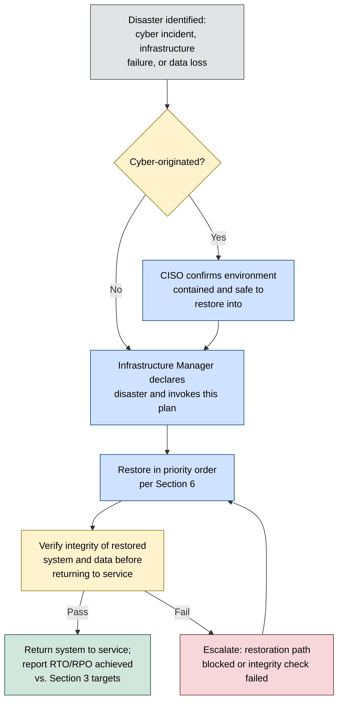

# Disaster Recovery Plan

**Organisation:** Westbridge Hospitals Trust (WHT)
**Document Type:** Disaster Recovery Plan
**Owner:** Infrastructure Manager
**Classification:** Portfolio Case Study – Fictional Organisation
**Version:** 1.0

# 1. Purpose

This plan sets out how WHT technically restores IT systems, infrastructure, and data following a disaster — including a cyber incident such as ransomware — to the recovery targets in §3. It is the document already cited as existing evidence in [../03-Current-State-Assessment/022-caf_assessment](../03-Current-State-Assessment/022-caf_assessment.md) §4.4 (CAF Objective D) and directly supports closing REC-003 in that assessment ("establish a recurring backup and disaster recovery test schedule") and CAF B5 Resilient Networks and Systems, currently rated **Not Achieved**. This plan addresses **technical restoration** of systems, infrastructure, and data; continuity of clinical and corporate service delivery while restoration is underway — including manual downtime procedures — is addressed in the companion [101-business_continuity_plan](101-business_continuity_plan.md).

# 2. Scope

This plan covers restoration of the assets in the [master assets register](../02-Asset-Management/022-master_assets_register.xlsx), with particular focus on the Infrastructure group (AST-015 to AST-018) that underpins every other system in the estate ([critical_assets](../02-Asset-Management/critical_assets.md) §4). It applies to disaster scenarios including: ransomware or destructive malware (CR-001), infrastructure or data centre failure, cloud service disruption (CR-012), and data loss from inadequate backup protection (CR-011). It does not cover containment and eradication of an active cyber threat, which remains owned by the CISO under [081-incident_response_plan](../08-Incident-Management/081-incident_response_plan.md) until the environment is confirmed safe to restore into (§5).

# 3. Recovery Objectives

Recovery Time Objective (RTO) and Recovery Point Objective (RPO) targets are set per asset tier, aligned to the service MTPDs in [101-business_continuity_plan](101-business_continuity_plan.md) §3 so that IT recovery is working toward the same deadlines the business needs, not a separately negotiated one.

| Tier | Systems | RTO (target) | RPO (target) | Backup Method |
|---|---|---|---|---|
| 1 — Life-critical clinical | EPR (AST-001), Pharmacy Management System (AST-005) | 4 hours | 15 minutes | Continuous/near-continuous replication where technically supported; database transaction log backup |
| 2 — Diagnostic and treatment-critical | LIS (AST-002), RIS (AST-003), PACS (AST-004) | 24 hours | 1 hour | Scheduled incremental backup, daily full backup |
| 3 — Enabling infrastructure | Core Network (AST-015), On-Premises Data Centres (AST-016), Azure Cloud Environment (AST-017), Entra ID (AST-029) | 4 hours (network/identity), 24 hours (data centre rebuild) | N/A (configuration, not transactional data) | Infrastructure-as-code / configuration backup where available; documented manual rebuild procedure otherwise |
| 4 — Corporate/administrative | Administrative and back-office systems | 72 hours | 24 hours | Scheduled daily backup |

**These are target objectives, not evidenced capabilities.** CR-011 ("data loss due to inadequate backup protection") is rated High and its treatment action — "offline/immutable backup implementation" — is Planned, not complete ([046-risk_treatment_plans](../04-Risk-Management/046-risk_treatment_plans.md) §3). Until that action and the recurring test schedule in §7 are delivered, these RTO/RPO figures represent the design intent of the backup architecture in §4, not a demonstrated recovery capability, and should not be relied upon as a commitment in a live incident without first confirming backup integrity for the specific system affected.

# 4. Backup and Recovery Architecture

Backup Infrastructure (AST-018) is owned by the Infrastructure Manager and provides the backup capability for the on-premises data centre estate (AST-016) and, where in scope, Azure-hosted workloads (AST-017). Current architecture:

| Component | Description | Status |
|---|---|---|
| On-premises backup | Scheduled backup of on-premises servers and databases to Backup Infrastructure (AST-018) | Operational |
| Cloud backup / Azure Backup | Backup of Azure-hosted workloads (AST-017) | Partial — coverage not yet confirmed complete across all Azure services ([../12-Azure-Governance/](../12-Azure-Governance/) not yet assessed) |
| Offline/immutable backup copy | A copy isolated from the production network and resistant to ransomware encryption or deletion | Not yet implemented — CR-011 treatment action, Planned, target Q4 2026 |
| Secondary/failover site | An alternate location or environment infrastructure can fail over to | Not established for on-premises Tier 1/2 systems; Azure Cloud Environment (AST-017) provides some inherent resilience for workloads already hosted there |

The absence of an offline/immutable backup copy is a material weakness specific to ransomware scenarios: if backup infrastructure is reachable from the production network, it is a target for encryption alongside primary systems, which is why CR-001's treatment actions in [046-risk_treatment_plans](../04-Risk-Management/046-risk_treatment_plans.md) §3 include "offline backup validation" as a named action, not an assumption that backups already provide ransomware resilience.

# 5. Disaster Declaration and Recovery Process

Where the disaster is cyber-originated, restoration must not begin until the CISO confirms the environment is contained ([081-incident_response_plan](../08-Incident-Management/081-incident_response_plan.md) §6) — restoring from backup into a still-compromised environment risks re-infection from the same vector, particularly for ransomware where dwell time before encryption can mean recent backups are already compromised. Restored systems are verified for integrity before being returned to service, not assumed clean because the restore process completed.

# 6. System Recovery Priority Order

Recovery follows the tier order in §3, with Tier 1 systems restored first regardless of the order disaster was detected, except where Tier 3 infrastructure a Tier 1 system depends on must be restored first as a technical prerequisite:

1. Core Network Infrastructure (AST-015) and Microsoft Entra ID (AST-029) — prerequisite for any dependent system to function
2. Electronic Patient Record (AST-001), Pharmacy Management System (AST-005)
3. Laboratory Information System (AST-002), Radiology Information System (AST-003), PACS (AST-004)
4. Remaining On-Premises Data Centre (AST-016) and Azure Cloud Environment (AST-017) workloads
5. Corporate and administrative systems

This order is set by the Infrastructure Manager in consultation with the CDIO, who confirms it still reflects current clinical priority at the time of declaration (§5) — the static order above is a starting assumption, not a substitute for that real-time check, since the relative urgency of, for example, pharmacy versus laboratory systems can depend on what is actually happening clinically at the time.

# 7. Roles and Responsibilities

| Role | Disaster Recovery Function |
|---|---|
| Infrastructure Manager | Owns this plan; declares disaster and directs technical recovery; owner of CR-011 treatment actions |
| CISO | Confirms environment is safe to restore into where the disaster is cyber-originated; retains incident ownership until containment is confirmed |
| CDIO | Confirms recovery priority order reflects current clinical need |
| Business Continuity Manager | Kept informed of recovery progress against [101-business_continuity_plan](101-business_continuity_plan.md) Tier MTPDs; owns any manual continuity arrangements while recovery is underway |
| Backup Service Owner | Maintains backup infrastructure (AST-018) and backup integrity; owner of CR-011 offline/immutable backup action |
| Cloud Service Owner | Executes recovery for Azure-hosted workloads (AST-017) |

# 8. Testing and Validation

No recurring backup or disaster recovery test schedule is currently in place. This is the specific gap recorded as REC-003 in [022-caf_assessment](../03-Current-State-Assessment/022-caf_assessment.md) §9 ("establish a recurring backup and disaster recovery test schedule with recorded outcomes to progress B5"), owned by the Infrastructure Manager with a target of Q4 2026, and is why CAF B5 Resilient Networks and Systems is rated **Not Achieved** rather than Partially Achieved. The [082-ransomware_tabletop_exercise](../08-Incident-Management/082-ransomware_tabletop_exercise.md) §2 specifically excluded a live technical failover, so no restore has yet been tested end-to-end against the RTO/RPO targets in §3. Until a test is run, the offline/immutable backup control in §4 and the recovery priority order in §6 remain design intent rather than verified capability.

# 9. Review and Maintenance

This plan is reviewed annually by the Infrastructure Manager, and after any disaster declaration (§5) or recovery test (§8), with findings reported to the CSGG per [051-security_strategy](../05-Governance/051-security_strategy.md) §6. It is maintained alongside [101-business_continuity_plan](101-business_continuity_plan.md); a change to an RTO/RPO target in §3 should be reflected in the corresponding service MTPD in [101-business_continuity_plan](101-business_continuity_plan.md) §3, and vice versa.

# 10. Recommendations

| Recommendation ID | Recommendation | Priority | Owner | Target Timeframe |
|---|---|---|---|---|
| REC-001 | Implement the offline/immutable backup copy (CR-011 treatment action) so backup infrastructure is not itself a ransomware target | High | Backup Service Owner | Q4 2026 |
| REC-002 | Establish a recurring backup and disaster recovery test schedule with recorded outcomes, including at least one full restore test against a Tier 1 system, to progress CAF B5 | High | Infrastructure Manager | Q4 2026 |
| REC-003 | Confirm and document Azure Backup coverage across all Azure-hosted workloads (AST-017) as part of the pending Azure Governance assessment ([../12-Azure-Governance/](../12-Azure-Governance/)) | Medium | Cloud Service Owner | Aligned to Azure Governance assessment |
| REC-004 | Establish a secondary/failover site or environment for Tier 1/2 on-premises systems, closing the single-site dependency identified in §4 | Medium | Infrastructure Manager | Q2 2027 |

# 11. Conclusion

WHT has a defined recovery objective structure, backup architecture, and declaration process, with recovery priority correctly weighted toward life-critical clinical systems. The material gap is validation: the offline/immutable backup control that would make backups ransomware-resilient is not yet implemented, and no restore has been tested end-to-end against the stated RTO/RPO targets. This is the same gap CAF identifies as REC-003 and as the reason B5 is rated Not Achieved — closing it is the highest-leverage next step for this plan, and should be prioritised ahead of refining the recovery objectives further.
